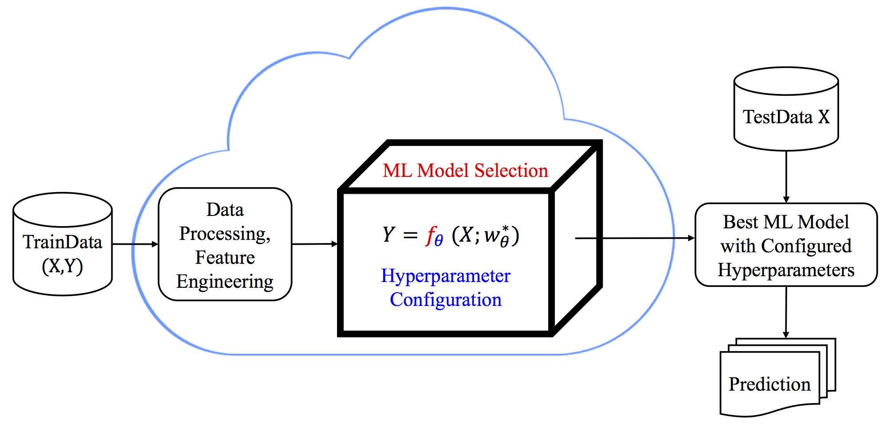

.. test documentation master file, created by
   sphinx-quickstart on Fri Dec 10 09:13:46 2010.
   You can adapt this file completely to your liking, but it should at least
   contain the root `toctree` directive.

Welcome to SeqMM's documentation!
==========================================

This is an open-source python package developed for automated machine learning, in particular for hyperparameter optimization problems. We provide an alternative approach to the well known Bayesian optimization methods, i.g., sequential uniform design-based hyperparameter optimization method.

- AutoML is to perform Automated Machine Learning model/algorithm selection and hyperparameter tuning.

- It also targets progressive automation of data preprocessing, feature extraction/transformation, postprocessing and interpretation.

- Hyperparameter optimization, a.k.a. (hyper) paramater tuning, plays a central role in AutoML pipelines. 

However, it is not easy. 
----------------------------------

- Hyperparameters can be continuous, integer-valued or categorical,  e.g. regularization parameters, kernel bandwidths, learning rate, tree depth, batch size, number of layers, type of activation.

-  Hyperparameter Optimization is of combinatorial nature, therefore a challenging problem with curse of dimensionality.

- There is limited understanding about tunability of ML hyperparameters (Probst et al., 2018). There are mostly empirical evidences.

- Robustness and reproducibility of optimal hyperparameters depend not only on the specific algorithm, but also on the specific dataset.

Contents:
------------
.. toctree::
   :maxdepth: 2

   Installation.rst
   pybatdoe.rst
   pybayopt.rst
   pysequd.rst
   Examples.rst
   APIs.rst