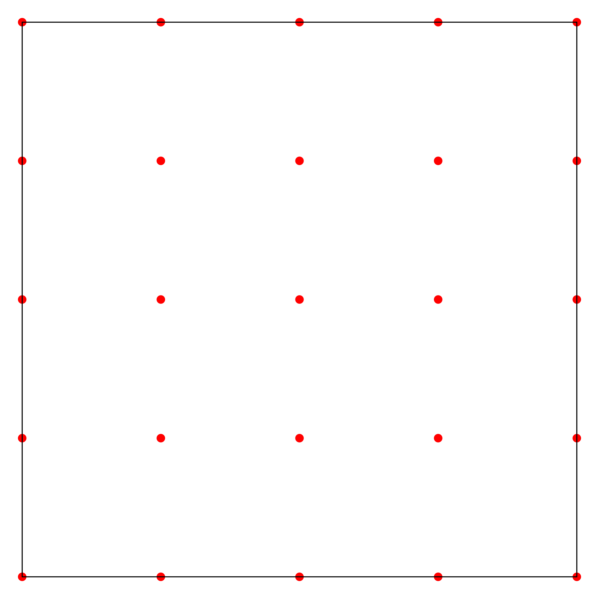
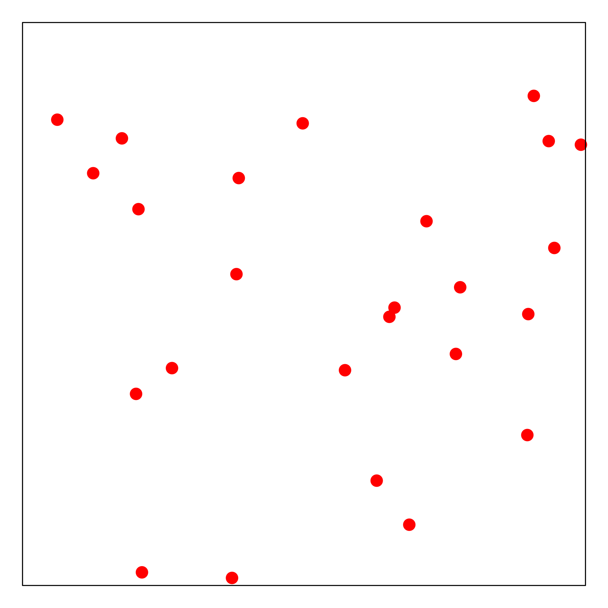
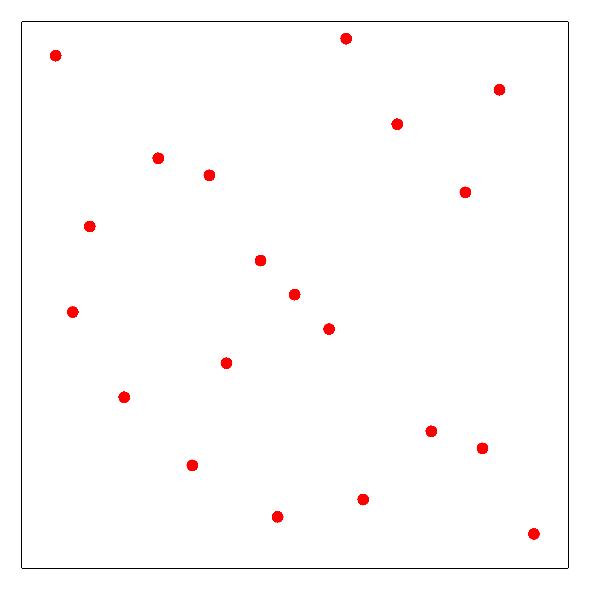

One-shot Batch Designs
==============================

Batch designs can generate all the experimental trials before conducting any experiments. See the following.

Simple Strategies 
------------------

- **Grid Search (Grid)**: exhaustive search over grid combinations.

- **Random Search (Rand)**: it is more flexible than grid search, when not all hyperparameters are equally important. Furthermore, new trials can be added without adjustment and the experiments can also be stopped any time ([Bergstra2012]_).

- **Latin Hypercube Sampling (LHS)**: near-random sample ([McKay1978]_).

- **Sobol Sequence (Sobol)**: quasi-random low-discrepancy sequence ([Sobol967]_).

The figures below ([Zhang2019]_) present the demo sampling history of the four mentioned approaches, including Grid search (top left), Random search (top right), Latin hypercube (bottom left) and Sobol Sequence (bottom right).

|pic1| |pic2| |pic3| |pic4|

.. |pic3| image::  ./images/Demo_LHS.png
   :width: 45%

Pros and Cons
---------------------

- Easy to be paralleled, trials can be generated without too much burden. 

- The information of existing experiments is not utilized, which is not efficient. 

- To select an appropriate number of design points is always difficult, with potential over-sampling and under-sampling problems.

Example Usage 
--------------

**Grid Search**::

        import numpy as np 
        from sklearn import svm
        from sklearn import datasets
        from sklearn.model_selection import KFold
        from seqmml import GridSearch

        iris = datasets.load_iris()
        ParaSpace = {'C':{'Type': 'continuous', 'Range': [-6, 16], 'Wrapper': np.exp2}, 
               'gamma': {'Type': 'continuous', 'Range': [-16, 6], 'Wrapper': np.exp2}}
        estimator = svm.SVC()
        cv = KFold(n_splits=5, random_state=1, shuffle=True)
        clf = GridSearch(ParaSpace, max_runs = 100, n_jobs = 10, 
                    estimator = estimator, cv = cv, refit = True, verbose = True)
        clf.fit(iris.data, iris.target)
        clf.plot_scores()

**Random Search**::

        import numpy as np 
        from sklearn import svm
        from sklearn import datasets
        from sklearn.model_selection import KFold
        from seqmml import RandSearch

        iris = datasets.load_iris()
        ParaSpace = {'C':{'Type': 'continuous', 'Range': [-6, 16], 'Wrapper': np.exp2}, 
               'gamma': {'Type': 'continuous', 'Range': [-16, 6], 'Wrapper': np.exp2}}
        estimator = svm.SVC()
        cv = KFold(n_splits=5, random_state=1, shuffle=True)
        clf = RandSearch(ParaSpace, max_runs = 100, n_jobs = 10, 
                    estimator = estimator, cv = cv, refit = True, verbose = True)
        clf.fit(iris.data, iris.target)
        clf.plot_scores()

**Latin Hypercube Sampling**::

        import numpy as np 
        from sklearn import svm
        from sklearn import datasets
        from sklearn.model_selection import KFold
        from seqmml import LHSSearch

        iris = datasets.load_iris()
        ParaSpace = {'C':{'Type': 'continuous', 'Range': [-6, 16], 'Wrapper': np.exp2}, 
               'gamma': {'Type': 'continuous', 'Range': [-16, 6], 'Wrapper': np.exp2}}
        estimator = svm.SVC()
        cv = KFold(n_splits=5, random_state=1, shuffle=True)
        clf = LHSSearch(ParaSpace, max_runs = 100, n_jobs = 10, 
                    estimator = estimator, cv = cv, refit = True, verbose = True)
        clf.fit(iris.data, iris.target)
        clf.plot_scores()
        
        
**Sobol Sequence**::

        import numpy as np 
        from sklearn import svm
        from sklearn import datasets
        from sklearn.model_selection import KFold
        from seqmml import SobolSearch

        iris = datasets.load_iris()
        ParaSpace = {'C':{'Type': 'continuous', 'Range': [-6, 16], 'Wrapper': np.exp2}, 
               'gamma': {'Type': 'continuous', 'Range': [-16, 6], 'Wrapper': np.exp2}}
        estimator = svm.SVC()
        cv = KFold(n_splits=5, random_state=1, shuffle=True)
        clf = SobolSearch(ParaSpace, max_runs = 100, n_jobs = 10, 
                    estimator = estimator, cv = cv, refit = True, verbose = True)
        clf.fit(iris.data, iris.target)
        clf.plot_scores()        