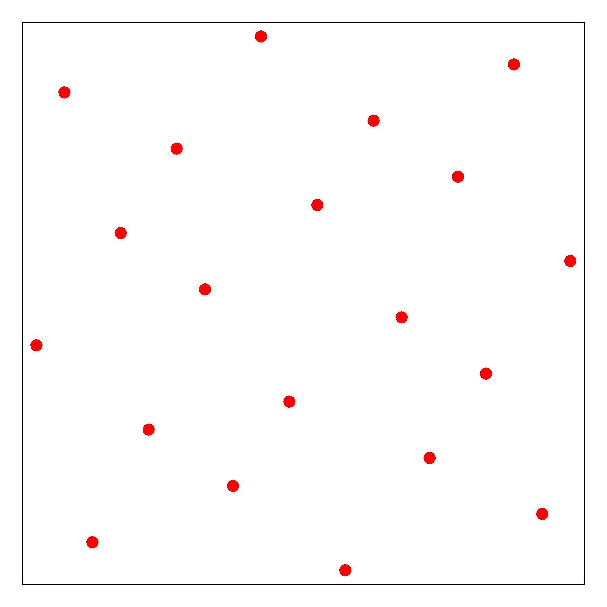
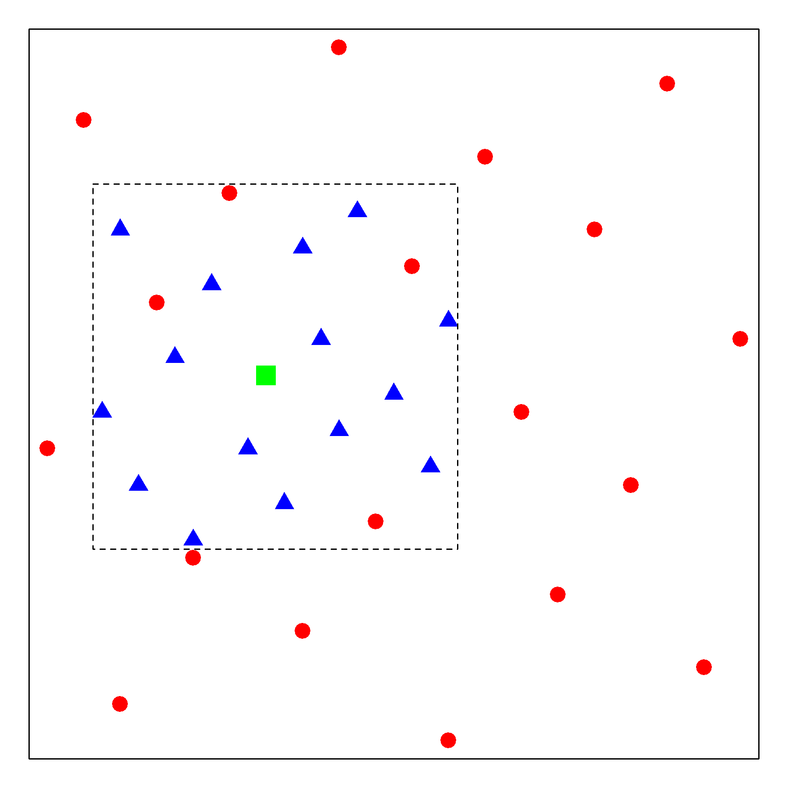

Sequential Uniform Design
==========================================

Introduction 
---------------

We advocate to reformulate AutoML as a kind of Computer Experiment for the purpose of maximizing ML prediction accuracy ([Yang2019]_).
Within CompExp framework, we propose a novel SeqUD approach for algorithm selection and optimal hyperparameter configuration. 
Uniform designs is a frequently used spacefilling design method, first proposed in the 1980s by Prof. Fang and Prof. Yuan. It aims at covering the search space uniformly, as shown in the figure below. 

However, it is still an one-shot design method, which has similar limitations as grid search and random search. Therefore, we develop a sequential uniform design method, which enjoys the advantage of batch design and sequential strategy. 

Algorithm 
------------------
- Define the search space by converting individual hyperparameters (upon necessary transformation) into unit hypercube :math:`[0,1]^d`: linear mapping if continuous/integer-valued, one-hot encoding if categorical.

- Start with :math:`\theta \in \mbox{UD}` to train ML algorithm; obtain CV scores;  find :math:`\hat\theta_0^*` from :math:`\mbox{UD}`

- Sequential refining strategy: for iterative step :math:`t=1,2,\ldots,T_{\max}`

     - Centered at :math:`\hat\theta^*_{t-1}`, define the search subspace with reduced range and increased granularity;
     
     - Find augmented UD in the subspace; train ML algorithm with new :math:`\theta` samples and obtain CV scores;
     
     - Collect all trained :math:`\{\theta, \mbox{CV}(\theta)\}`, and find :math:`\hat\theta_t^{*}`.
     
- Output the optimal :math:`\theta^*` from all trained    :math:`\{\theta, \mbox{CV}(\theta)\}`.

A Simple Demo 
----------------

The figure below shows a two-stage example of the SeqUDHO approach in a 2-D space. The circle points represent the initial uniform design via :math:`U_{20}(20^{2})`. The surrounding box serves as the subspace of interest centered on the optimal trial :math:`\x^{*}_{1}` at the first stage, which is denoted by a square point in green. At the second stage, new trial points are augmented to form a :math:`U_{20}(20^{2})`, denoted by the blue triangle points.

    
The proposed approach is advantageous over the Bayesian optimization methods.

- Uniformly distributed trials can have a better exploration;

- It is free from the meta-modeling and acquisition optimization;

- At each stage, the algorithm could be conducted in parallel.

Code Examples 
--------------

Uniform Design::

        import numpy as np 
        from sklearn import svm
        from sklearn import datasets
        from sklearn.model_selection import KFold
        from seqmm import UDSearch

        iris = datasets.load_iris()
        ParaSpace = {'C':{'Type': 'continuous', 'Range': [-6, 16], 'Wrapper': np.exp2}, 
               'gamma': {'Type': 'continuous', 'Range': [-16, 6], 'Wrapper': np.exp2}}
        estimator = svm.SVC()
        cv = KFold(n_splits=5, random_state=1, shuffle=True)
        clf = UDSearch(ParaSpace, level_number = 20, max_runs = 100, max_search_iter = 30, n_jobs = 10, 
                  estimator = estimator, cv = cv, refit = True, verbose = True)
        clf.fit(iris.data, iris.target)
        clf.plot_scores()
        
SVM for Classification::

        import numpy as np
        from sklearn import svm
        from sklearn import datasets
        from matplotlib import pylab as plt
        from sklearn.model_selection import KFold 
        from sklearn.preprocessing import MinMaxScaler
        from sklearn.model_selection import cross_val_score
        from sklearn.metrics import make_scorer, accuracy_score
        from seqmm.pysequd import SeqUDSklearn

        sx = MinMaxScaler()
        dt = datasets.load_breast_cancer()
        x = sx.fit_transform(dt.data)
        y = dt.target

        ParaSpace = {'C':     {'Type': 'continuous', 'Range': [-6, 16], 'Wrapper': np.exp2}, 
                     'gamma': {'Type': 'continuous', 'Range': [-16, 6], 'Wrapper': np.exp2}}

        estimator = svm.SVC()
        score_metric = make_scorer(accuracy_score, True)
        cv = KFold(n_splits=5, random_state=0, shuffle=True)

        clf = SeqUD(ParaSpace, level_number = 20, max_runs = 100, max_search_iter = 30, n_jobs = 10, 
                  estimator = estimator, cv = cv, refit = True, verbose = True)
        clf.fit(x, y)
        clf.plot_scores()
        
        
Xgboost for Regression::

        import numpy as np
        import xgboost as xgb
        from sklearn import datasets
        from sklearn.model_selection import KFold 
        from sklearn.preprocessing import MinMaxScaler
        from sklearn.metrics import make_scorer, mean_squared_error
        from seqmm.pysequd import SeqUDSklearn

        dt = datasets.load_diabetes()
        sx = MinMaxScaler()
        sy = MinMaxScaler()
        x = sx.fit_transform(dt.data)
        y = sy.fit_transform(dt.target.reshape([-1,1]))

        ParaSpace = {'booster':          {'Type': 'categorical', 'Mapping': ['gbtree', 'gblinear']},
                     'max_depth':        {'Type': 'integer',     'Mapping': np.linspace(2,10,9)}, 
                     'n_estimators':     {'Type': 'integer',     'Mapping': np.linspace(100,500,401)},
                     'min_child_weight': {'Type': 'integer',     'Mapping': np.linspace(1,100,100)},
                     'subsample':        {'Type': 'continuous',  'Range': [0, 1],  'Wrapper': lambda x:x},
                     'colsample_bytree': {'Type': 'continuous',  'Range': [0, 1],  'Wrapper': lambda x:x},
                     'learning_rate':    {'Type': 'continuous',  'Range': [-5, 0], 'Wrapper': lambda x: 10**x},
                     'gamma':            {'Type': 'continuous',  'Range': [-5, 0], 'Wrapper': lambda x: 10**x},
                     'reg_lambda':       {'Type': 'continuous',  'Range': [-5, 0], 'Wrapper': lambda x: 10**x},
                     'reg_alpha':         {'Type': 'continuous',  'Range': [-5, 0], 'Wrapper': lambda x: 10**x}}

        Level_Number = 20
        estimator = xgb.XGBRegressor()
        score_metric = make_scorer(mean_squared_error, False)
        cv = KFold(n_splits=5, random_state=0, shuffle=True)

        clf = SeqUD(ParaSpace, level_number = 20, max_runs = 100, max_search_iter = 30, n_jobs = 10, 
                  estimator = estimator, cv = cv, refit = True, verbose = True)
        clf.fit(x, y)
        clf.plot_scores()

Kmeans for Unsupervised Clustering::

        import numpy as np
        from sklearn import datasets
        from sklearn.cluster import KMeans
        from sklearn.model_selection import KFold 
        from sklearn.preprocessing import MinMaxScaler
        from seqmm.pysequd import SeqUDSklearn

        sx = MinMaxScaler()
        dt = datasets.load_iris()
        x = sx.fit_transform(dt.data)
        y = dt.target.reshape([-1,1])

        ParaSpace = {'n_clusters':  {'Type': 'integer',    'Mapping': np.linspace(2,9,8)}, 
                     'tol':         {'Type': 'continuous', 'Range': [-6, -3], 'Wrapper': lambda x: 10**x}}

        Level_Number = 20
        estimator = KMeans()
        cv = KFold(n_splits=5, random_state=0, shuffle=True)

        clf = SeqUD(ParaSpace, level_number = 20, max_runs = 100, max_search_iter = 30, n_jobs = 10, 
                  estimator = estimator, cv = cv, refit = True, verbose = True)
        clf.fit(x)
        clf.plot_scores()
        
        
Reference list 
_______________

.. [Yang2019] Zebin Yang, Aijun Zhang and Ji Zhu. (2019) Hyperparameter Optimization via Sequential Uniform Designs. Submitted.
